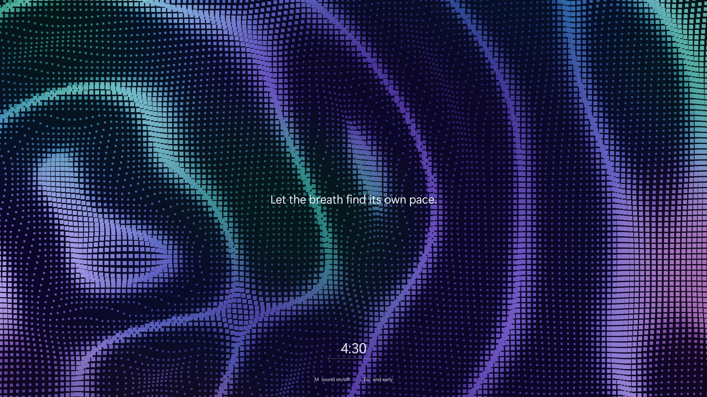
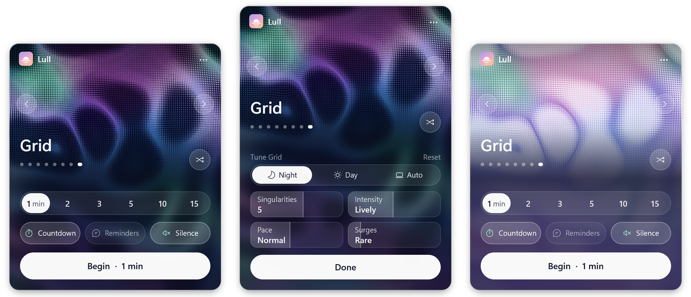
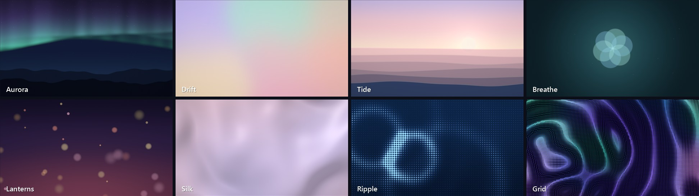
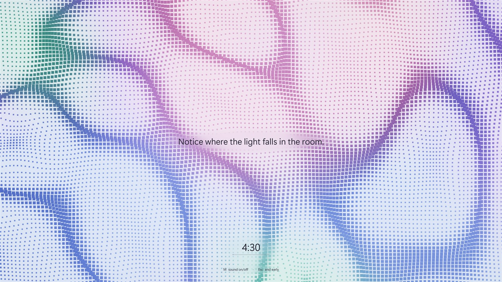
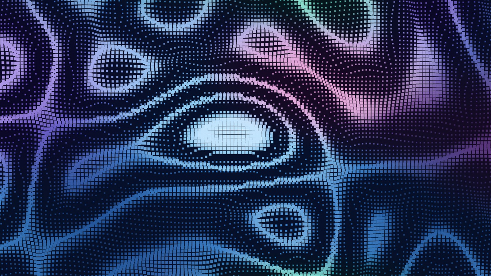

# Lull

**A quiet pause for your eyes and mind.**

Lull lives in the Windows tray. Pick a few minutes and your screen fades into a slow, calming
scene. The keyboard is shut out until the time is up, so the break actually happens.



- **Eight living scenes**, drawn on the GPU in real time: Aurora, Drift, Tide, Breathe, Lanterns,
  Silk, Ripple and Grid.
- **A real break.** Every monitor is covered and the cursor is hidden. Alt+Tab, the Win key and
  friends don't reach Windows.
- **Synergy keeps working.** Mouse-sharing tools still let you use your other machines.
- **Gentle company.** An optional countdown and 89 short reminders, in text that adapts to the
  scene behind it.
- **Optional silence.** Mutes every sound output for the length of a lull, then restores exactly
  what it muted.
- **Hard to skip, not impossible.** Ending early means solving a math riddle. There are 193, each
  with a short explanation if you get it wrong.
- **Tiny.** A single ~700 KB `.exe`, with no installer and no runtime dependencies.

## Download

Get `Lull.exe` from the [latest release](https://github.com/scherzma/lull/releases/latest) and run
it. It's made for Windows 11; it may run on Windows 10, but that's untested. There's nothing to
install: it appears in the tray, and settings live in `%APPDATA%\Lull`. To have it start with
Windows, right-click the tray icon.
- The exe isn't code-signed, so Windows SmartScreen may warn the first time. Choose
  *More info → Run anyway*.
- While a lull runs, Lull uses a low-level keyboard hook to block keys. Some antivirus tools are
  wary of that. It's only active during a lull, and the full source is here.

## The panel



- **Left-click** the tray icon (the little sunset) to open Lull.
  - The top is a live preview of the scene. Browse with ‹ ›, the dots, the mouse wheel over the
    preview, or ←/→. The shuffle button picks a different scene every time.
  - Pick a length: 1, 2, 3, 5, 10 or 15 minutes. You can also scroll over the lower half or press
    ↑/↓.
  - Switch **Countdown**, **Reminders** and **Silence** on or off.
  - Click **Begin**, or press Enter.
- **Right-click** the tray icon for quick starts and every setting:
  - countdown
  - reminders
  - chime when finished
  - early exit
  - start with Windows
- **To keep the icon next to the clock**, drag it from the `^` overflow onto the taskbar. Or
  right-click Lull, choose *Pin icon next to the clock…*, and switch Lull on. Windows doesn't let
  apps place themselves there.

## Scenes



- **Aurora:** northern lights over dark hills.
- **Drift:** slow washes of soft colour.
- **Tide:** a sunset over layered water.
- **Breathe:** an orb that paces your breathing (in 4 s, hold, out 6 s), with cues instead of
  reminders.
- **Lanterns:** warm lights floating up through dusk.
- **Silk:** folds of pale fabric.
- **Ripple:** blue dots carried by expanding waves.
- **Grid:** see below.

## Grid

<table>
  <tr>
    <td></td>
    <td></td>
  </tr>
  <tr>
    <td align="center">The day look</td>
    <td align="center">A superwave breaking</td>
  </tr>
</table>

The screen is a 2D slice through a 3D volume. A few wave sources, the *singularities*, drift
through that volume on slow orbits, and the slice itself slowly tilts and turns. So rings appear,
grow, merge and vanish as waves cross it. Thousands of small squares follow the contours of the
combined field: they swell on the ridges, shrink between them, and bunch up along the slopes.

### Superwaves

Now and then the crests of several singularities reach the same spot at the same moment, usually
while one of them flares, and pile up past a *breaking height*.
- **What you see:** the squares there swell into a pale, white-hot crest (warm sunlight in the day
  look). The water around it draws back into a dark trough. The whole surface folds harder, and
  Grid's time rushes, up to 3.5×, until the crests drift apart.
- **Nothing schedules them.** A superwave is just the same field at an extreme. Every motion in it
  is a steady rhythm (orbits, waves, flares, the slice's tilt), and no two rhythms line up
  exactly. By Kronecker–Weyl equidistribution, the field passes through all its combinations
  evenly. So breaking moments keep coming back, but never on a beat.
- **Every lull is different.** Each lull starts from a new random environment: where the
  singularities sit and how their rhythms are phased. Some lulls turn out stormier than others.
- **How often:** in simulation on *Frequent*, about 7–8 per 10 minutes, often in sets of two or
  three. On *Rare*, once or twice.

### Hidden: tune Grid

With **Grid** selected, **double-click the preview** in the panel to open the **Tune Grid** sheet.
Changes show live in the preview. To change a setting, drag across its tile or scroll over it.
- **Look:**
  - *Night:* deep blues, violets, teals and the odd rose.
  - *Day:* a pale, misty pastel sky with deeper pastel ridges.
  - *Auto:* follows Windows' light or dark app mode.
- **Singularities** (1–8): how many wave sources drift through the volume.
- **Intensity** (Calm → Extreme): how densely the contours fold, how far the squares get pushed,
  and how often and how hard a source flares.
- **Pace** (Slow → Fast).
- **Surges** (Never → Frequent): how low the breaking height is.
  - It scales with √(singularities), like the waves' peaks do, so the rate barely changes with
    the count.

Press **Done**, Esc, or double-click again to close it.

## During a lull

- **Every monitor** is covered, the mouse cursor is hidden, and the display stays awake.
- **Blocked:** keys like Win, Alt+Tab, Ctrl+Esc, Ctrl+Shift+Esc and Alt+F4 don't reach Windows.
- **Still working:** volume and media keys.
- **Reminders** are shown one at a time. On Breathe they become breathing cues instead.
- **Text follows the scene.** A few times a second, Lull looks at the scene behind the countdown,
  reminder and hints.
  - Each line gets light or dark ink, whichever stands out more, faintly tinted with the scene's
    own colour.
  - On busy scenes, the pattern right behind a line is softly blurred so it doesn't cut through
    the letters.
- **Sound:** press **M** at any time to switch sound off or on (a small toast confirms it). When
  the lull ends, whatever Lull muted is unmuted again. Outputs you'd muted yourself are left
  alone. If Lull is ever killed mid-lull, it unmutes them the next time it starts.
- **Ending early** (if allowed): press **Esc**, then:
  - for lulls of **5 minutes or less**, solve **one math riddle**;
  - for longer lulls, solve **3 in a row**: two quick calculations and one riddle.
  - A wrong answer shows the correct answer and a short guide to it. Read as long as you like.
    After a 3-second lock, Enter gives you a new problem.
  - The card stays open until you press Esc, so take your time.
  - Riddles come in a shuffled order that's remembered between sessions, so none repeats until
    you've seen them all.
- **Always available:** Windows itself reserves `Ctrl+Alt+Del` and `Win+L`.

### Synergy and other mouse-sharing tools

Synergy, Deskflow, Barrier, Input Leap and Mouse Without Borders keep working. Move the mouse off
the screen edge and you can use your other machines as usual, keyboard included.
- Lull's keyboard blocker first passes each key down the rest of the system's keyboard hook chain.
- When Synergy is forwarding a key to another machine, it swallows the key, and Lull leaves it
  alone. Only keys meant for this PC are blocked.
- The cursor on other machines is drawn by those machines, so it stays visible there.

## Building

You need Visual Studio with the C++ workload: MSVC, the Windows SDK, `fxc` and `rc`.

```bat
build.cmd
```

The result is a single `build\Lull.exe`. Run it from anywhere. Settings are stored in
`%APPDATA%\Lull\settings.ini`.

Under the hood:
- C++20 and plain Win32.
- Scenes are Direct3D 11 pixel shaders.
- The panel and text use Direct2D and DirectWrite.
- Windows are composed with DirectComposition.
- Silence uses Core Audio.

## Developer switches

| Switch | What it does |
| --- | --- |
| `--start <minutes>` / `--start-seconds <n>` | Begin a lull right away. Forwarded to the running instance if there is one. |
| `--dev` | A lull without the keyboard blocker; Esc opens the challenge. |
| `--render-scenes <dir> [t]` | Render every scene to PNG. |
| `--snap-flyout <file.png> [tune]` | Render the tray panel (or its tuning sheet) to a transparent PNG. |
| `--snap-overlay <dir>` | Render every scene with the countdown and a reminder on top. |
| `--snap-text <dir>` | Render every scene at two moments with only the reminder, countdown and hint, at the primary monitor's size and scaling (text contrast check). |
| `--ink-test <file.txt>` | Run the live text-colour measurement on an offscreen Grid for a second and log it. |
| `--surge-test <file.txt>` | Simulate 20 minutes of Grid in five random environments at several Surges settings: how often the waves break, gaps, speeds. |
| `--surge-frames <dir>` | Find the biggest wave in 20 minutes of Grid time and render the moments around it to PNGs. |
| `--selftest-hook <file.txt>` | Check that a hook further down the chain can swallow keys and Lull sees it. |
| `--export-icon <file.ico>` | Regenerate `res\lull.ico`. |

Put `--day` or `--night` before a render switch to use that Grid look. Set `LULL_DEBUG=1` to
write a small log to `%TEMP%\lull-debug.log`.

## Layout

| Path | Contents |
| --- | --- |
| `src/main.cpp` | Tray icon, menu, single instance, main loop, dev switches |
| `src/flyout.cpp` | The tray panel and the Grid tuning sheet |
| `src/overlay.cpp` | The lull: windows, keyboard blocker, countdown, reminders, adaptive text, math challenge |
| `src/gfx.cpp`, `src/gfx.h` | Direct3D 11, Direct2D and DirectComposition plumbing; Grid's clock and superwave math |
| `src/audio.cpp` | Muting and restoring sound outputs |
| `src/settings.cpp` | Settings and theme |
| `src/icon.cpp` | Tray glyph, logo, `.ico` export |
| `src/chime.cpp` | The synthesized end chime |
| `src/devtools.cpp` | Render, hook and surge tests |
| `src/prompts.inc` | The reminders |
| `src/riddles_a.inc`, `src/riddles_b.inc` | Math riddles for the early-exit challenge, with answers and guides |
| `shaders/scenes.hlsl` | All scenes, compiled once per scene |
| `shaders/common.hlsl` | Fullscreen triangle and the final blit |
| `res/` | Icon, manifest, resource script |
| `docs/` | Screenshots for this README |

## License

Lull is free for personal and other noncommercial use, under the
[PolyForm Noncommercial License 1.0.0](LICENSE.md).
- **You may** use it, study it, change it and share it, as long as it's not for commercial
  purposes. Charities, schools and public institutions are welcome too.
- **Commercial use** isn't covered. If you'd like that, open an issue and ask.
